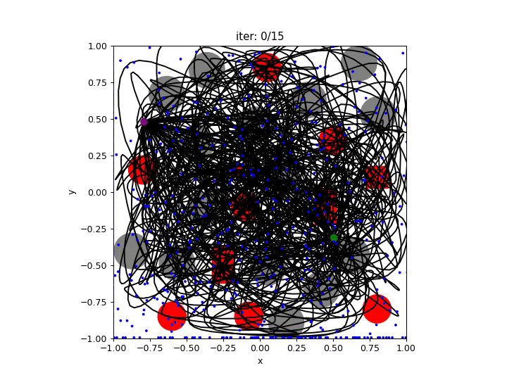
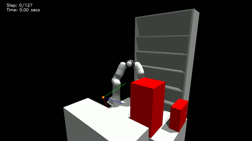

# Motion Planning Diffusion: Learning and Adapting Robot Motion Planning with Diffusion Models

[](https://ieeexplore.ieee.org/abstract/document/11097366)
[](https://arxiv.org/abs/2412.19948)
[](https://sites.google.com/view/motionplanningdiffusion/)
[]()


<div style="display: flex; text-align:center; justify-content: center">
    
    
</div>

This repository implements Motion Planning Diffusion (**MPD**) - a method for learning and planning robot motions with diffusion models.

An older version of this project is deprecated, but still available at [https://github.com/jacarvalho/mpd-public](https://github.com/jacarvalho/mpd-public).

Please contact me if you have any questions -- [joao@robot-learning.de](mailto:joao@robot-learning.de)

---
# Installation

Pre-requisites:
- Ubuntu 22.04 (maybe works with newer versions)
- [miniconda](https://docs.conda.io/projects/miniconda/en/latest/index.html)

Clone this repository
```bash
mkdir -p ~/Projects/MotionPlanningDiffusion/
cd ~/Projects/MotionPlanningDiffusion/
git clone --recurse-submodules git@github.com:joaoamcarvalho/mpd-splines-public.git mpd-splines-public
cd mpd-splines-public
```

Download [IsaacGym Preview 4](https://developer.nvidia.com/isaac-gym) and extract it under `deps/isaacgym`
```bash
mv ~/Downloads/IsaacGym_Preview_4_Package.tar.gz ~/Projects/MotionPlanningDiffusion/mpd-splines-public/deps/
cd ~/Projects/MotionPlanningDiffusion/mpd-splines-public/deps
tar -xvf IsaacGym_Preview_4_Package.tar.gz
```

Run the bash setup script to install everything (it can take a while).
```bash
bash setup.sh
```

Make sure to set environment variables and activate the conda environment before running any scripts.
```bash
source set_env_variables.sh
conda activate mpd-splines-public
```

---
## Download the datasets and pre-trained models

Download https://drive.google.com/file/d/1KG5ejn0g0KkDuUK6tPUqfmRYCNoKzK4K/view?usp=drive_link

```bash
tar -xvf data_public.tar.gz
ln -s data_public/data_trajectories data_trajectories
ln -s data_public/data_trained_models data_trained_models
```


---
## Inference with pre-trained models

The configuration files under [scripts/inference/cfgs](scripts/inference/cfgs) contain the hyperparameters for inference.\
Inside the file `scripts/inference/inference.py` you can change the `cfg_inference_path` parameter to try models trained for different environments.

```bash
cd scripts/inference
python inference.py
```


---
# Training the prior models (from scratch)


## Data generation

Generating data takes a long time, so we recommend [downloading the dataset](#download-the-datasets-and-pre-trained-models).
But if anyway you want to generate your own data, you can do it with the scripts in the `scripts/generate_data` folder.

Go to the `scripts/generate_data` folder.

The base script is
```bash
python generate_trajectories.py
```

To generate multiple datasets in parallel, adapt the `launch_generate_trajectories.py` script.
```bash
python launch_generate_trajectories.py
```

After generating the data, run the post-processing file to combine all data into a hdf5 file.
Then you can double the dataset by flipping the trajectory paths.
```bash
python post_process_trajectories.py --help
python flip_solution_paths.py  (change the PATH_TO_DATASETS variable)
```

To visualize the generated data, use the `visualize_trajectories.py` script.
```bash
python visualize_trajectories.py
```

---
## Training the models

The training scripts are in the `scripts/train` folder.

The base script is
```bash
cd scripts/train
python train.py
```

To train multiple models in parallel, use the `launch_train_*` files.


---
## Citation

If you use our work or code base, please cite our articles:
```latex
@article{carvalho2025motion,
  title={Motion planning diffusion: Learning and adapting robot motion planning with diffusion models},
  author={Carvalho, Jo{\~a}o and Le, An T and Kicki, Piotr and Koert, Dorothea and Peters, Jan},
  journal={IEEE Transactions on Robotics},
  year={2025},
  publisher={IEEE}
}

@inproceedings{carvalho2023motion,
  title={Motion planning diffusion: Learning and planning of robot motions with diffusion models},
  author={Carvalho, Jo{\~a}o and Le, An T and Baierl, Mark and Koert, Dorothea and Peters, Jan},
  booktitle={IEEE/RSJ International Conference on Intelligent Robots and Systems (IROS)},
  year={2023}
}
```


---
## Credits

Parts of this work and software were taken and/or inspired from:
- [https://github.com/jannerm/diffuser](https://github.com/jannerm/diffuser)
