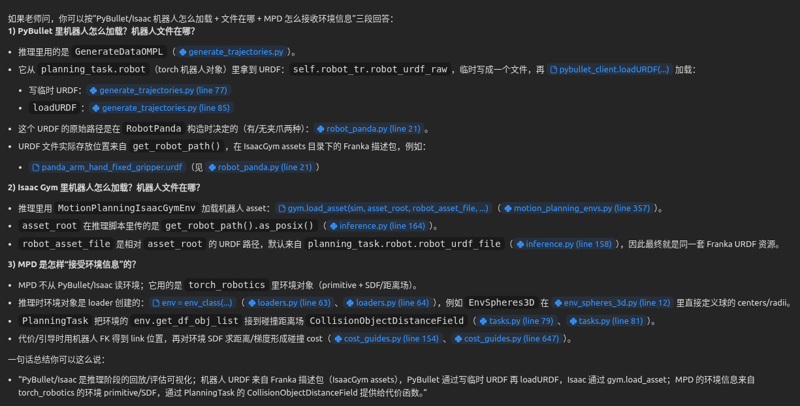

cd /workspaces/MPDLX-B-new/mpd-splines-public/scripts/inference
source ../../set_env_variables.sh
python inference.py

DDIM
----------------METRICS----------------
t_inference_total: 2.077 sec
t_generator: 0.073 sec
t_guide: 1.998 sec
isaacgym_statistics:
DotMap()
metrics:
{'trajs_all': {'collision_intensity': array(0.005, dtype=float32),
               'ee_pose_goal_error_orientation_norm_mean': array(1.364, dtype=float32),
               'ee_pose_goal_error_orientation_norm_std': array(0.719, dtype=float32),
               'ee_pose_goal_error_position_norm_mean': array(0.02, dtype=float32),
               'ee_pose_goal_error_position_norm_std': array(0.01, dtype=float32),
               'fraction_valid': 0.85,
               'fraction_valid_no_joint_limits_vel_acc': 0.85,
               'success': 1,
               'success_no_joint_limits_vel_acc': 1},
 'trajs_best': {'ee_pose_goal_error_orientation_norm': array(0.688, dtype=float32),
                'ee_pose_goal_error_position_norm': array(0.002, dtype=float32),
                'path_length': array(6.992, dtype=float32),
                'smoothness': array(57.6, dtype=float32)},
 'trajs_valid': {'diversity': array(85., dtype=float32),
                 'ee_pose_goal_error_orientation_norm_mean': array(1.319, dtype=float32),
                 'ee_pose_goal_error_orientation_norm_std': array(0.669, dtype=float32),
                 'ee_pose_goal_error_position_norm_mean': array(0.019, dtype=float32),
                 'ee_pose_goal_error_position_norm_std': array(0.01, dtype=float32),
                 'path_length_mean': array(8.245, dtype=float32),
                 'path_length_std': array(1.092, dtype=float32),
                 'smoothness_mean': array(78.746, dtype=float32),
                 'smoothness_std': array(26.033, dtype=float32)}}

python3 mpd-splines-public/scripts/inference/run_dpm_solver_best_sweep.py \
  --base_cfg mpd-splines-public/scripts/inference/cfgs/config_EnvSpheres3D-RobotPanda_00.yaml \
  --planner_alg mpd \
  --phase all \
  --seeds 0,1,2 \
  --coarse_steps 60 \
  --coarse_orders 2 \
  --coarse_time_modes continuous \
  --no_coarse_compare_solver_pp \
  --top_k 1 \
  --refine_methods multistep \
  --refine_skip_types logSNR \
  --refine_solver_types dpmsolver \
  --refine_lower_order_final false \
  --refine_denoise_to_zero true \
  --refine_prior_weights 1.1,1.2,1.3,1.4,1.5,1.6,1.7,1.8,1.9,2.0 \
  --refine_n_guide_steps 1 \
  --refine_guide_lr 0.02 \
  --refine_max_perturb_x 0.1 \
  --refine_t_start_guide_steps_fraction 0.2 \
  --results_root mpd-splines-public/scripts/inference/logs/sweep_dpm_solver_pw_to2_steps60 \
  --collect_metrics \
  --device cuda:0

xhost +local:root

cd /workspaces/MPDLX-B-new/mpd-splines-public/deps/isaacgym/python/examples

1.解决了conda转换问题 2.增加了一些依赖（其实是修补conda） 3.因为docker的文件结构设置错误导致很长一段时间在解决文件路径无法找到的问题 4.存在PB_OMPL库依赖的问题，正在删减对应的代码。 5.正在寻找ROS2/MPD联动的方式 6.PPT正在制作中，有没有什么模板或者要求？ 7待议

1.不同的难度梯度设置的初衷-模仿真实环境，轨迹解从多模态到收敛于唯一解（即环境更严苛） 2探究问题：训练后的泛化性怎么样

！！！！可能要向老师提的问题：泛化性如果不好，我不就要自己训练模型了吗？？

提一下DDPM可能无法参与NFE的比较，因为需要的步数太多

询问ppt用xxx模板是否可以

1探究保存的动画是什么？2为什么没有可视化的轨迹（与pybullt有关？重读MPD）  3.确定MPD接受的信息是什么

给老师展示实验快照的相关参数以说明3060的推理速度完全可以

如果用gazebo大概要：
写一个 ROS2 节点，把 /joint_states + 目标位姿/关节，通过 service / action 转成 MPD 需要的 q_start、goal；

把 Gazebo 里的障碍（model_states）转成 MPD 里用的“球/几何体参数”（EnvSpheres3D 那一套）；

MPD 推理完，把 B 样条轨迹离散成 trajectory_msgs/JointTrajectory，再丢给 ros2_control 或 MoveIt 执行。

工程量可能太大，不稳定：
1.不再用ros2 改用isaac+GYM
2.以有的训练数据是否适用于新的实验场景
3.解决isaac的问题后，可能工程量减小很多，但是对于学习isaac的成本未知
项目中isaac各种指标已经写好了，如果是这样，so101是否还有意义？还是用panda

isaac的不确定性：
如果不用gazebo而是isaac要做的事情：解决目前的一些问题，进行相应的issac学习，通过相应的标的来创建一些新的合适的实验场景

询问ai，新场景是否适用：ai回答场景只要没有新物品问题不大
可以在isaac中增加一些新的衡量指标（具体已有哪些指标需要看代码问ai）

项目观察结论:cost不是isaac给MPD的而是自己先写进去的
找一下还有哪些采样器可以进行替换以弥补工作量。搞清MPD和采样器接口的具体形式，参数
确实MPD用的是否是我以为的isaac

同一个3D球障碍场景只针对规划难度进行位置变化（如球之前从宽阔到狭窄，到唯一解 ：还是要问ai和论文）

这是我在从复现MPD+isaac的论文项目在docker中到转换成在MPD+gazebo然后前期调研发现不行转而尝试回到mpd+isaac的过程中的一系列琐碎的备忘录。请你帮我整理这些文字

除了项目，还有isaac的docker
排查出了isaac的问题（有gui界面但是黑屏）
    1.有可能是起GPU Pepline在docker中无法正常运行，换成在宿主机中运行 
    2.显卡版本太高换成535（此问题可能性较小

排除了pybullt的相关问题：

‘’‘
planning_task.parametric_trajectory 没有 dt，在播放 PyBullet 轨迹时取这个属性就报错了。已在基础类里补上 dt（从时间网格前两点相减得到步长），这样推理时的 sleep_time 不再抛异常。

修改文件：
mpd/parametric_trajectory/trajectory_base.py：
在line 34 初始化时新增 self.dt = float((self.phase_time.t[1] - self.phase_time.t[0]).item())
现在在同样命令运行推理，不会再出现 ParametricTrajectoryBspline 没有 dt 的错误

’‘’

关于这一项render_joint_space_env_iters: bool = True
由于显存要求过大所以无法开启

一对字母的对话：

*“全程缩放不一致”**的意思是：论文/DDPM/DDIM 的语义是“只有在进入 cost-guidance 的末段时才把先验项按 λprior 加权；在前面的高噪声阶段先验权重应当是 1”。但你们现在的 DPM-Solver/UniPC 实现是“只要 guide!=None，就从第 1 步到最后一步都乘 prior_weight_with_guide”。

一个直观例子：假设总共 15 步、最后 3 步才做 guidance。

DDPM/DDIM（更接近论文 Algorithm 2）：前 12 步用 λprior=1，最后 3 步用 λprior=0.25。
现在的 DPM-Solver/UniPC：15 步全都用 λprior=0.25（因为 guide!=None）。
这就改变了“前段纯 prior 去噪”的性质，所以叫“不一致”。
eps_pred 和 noise_pred 是不是同一个？
在你们训练配置 predict_epsilon: true 下，它们本质上都是网络输出的 (\epsilon_\theta)（只是变量名不同）。只有当 predict_epsilon=False（网络输出 (x_0)）时，两者才会被代码转换/区分（DPM-Solver 里也有这段转换：dpm_solver_sampler.py (line 131)）。

理论上对 DPM-Solver / UniPC 哪种更好？（指“全程缩放 vs 末段缩放”）

如果你追求和 MPD 论文一致、可解释、便于对齐调参：更推荐 DDIM/DDPM 那种“末段才启用 λprior”。论文 Algorithm 2 明确写了 if i > i_cost then λprior=1（2412.19948v3.txt (line 1535)），并且给了经验超参范围（2412.19948v3.txt (line 3125)）。
“全程缩放”并非一定更差，但它等价于：从高噪声开始就把 prior 的温度/强度改掉，你采样的动力学和论文设定不一样，通常需要重新调一套超参，而且很难和 DDIM 的 λprior 做一一对应比较。
是不是因为离散/连续时间导致的？
不是本质原因。DDIM 是显式离散步循环，所以很容易按“步号/阶段”开关 λprior；DPM-Solver/UniPC 用的是“solver 内部多次调用 model_fn”的连续时间接口，model_fn 本身拿不到“当前第几步”这个信息，实现者为了省事就写成 if guide is not None: scale（全程）。这更像是工程实现选择，不是连续时间理论上必须这么做；同样可以用“时间阈值/预计算 time grid”去做末段 gating。