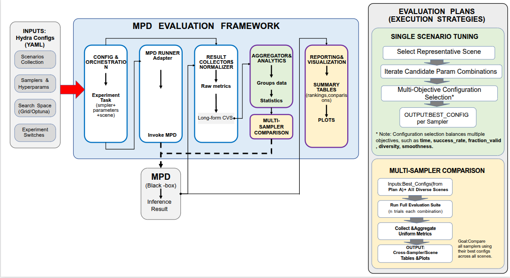

目标：
做一套可复用的评测流水线，让可以用于测评在“diffusionbaesdmodel为基础的模型”下更换不同采样器的效果，使其能在同一套规则下被自动运行、自动收集指标、自动统计与对比，最后产出数据表格和图。

在初步阶段我会用这套工具配合MPD，MPD负责生成轨迹并计算指标（这里没有让测评工具实现计算指标是因为考虑到不同模型在计算轨迹指标时可能并不使用同样的标准或数据形式，不利于测评工具的通用性设计原则）；测评工具负责配置管理、批量运行、数据收集、聚合统计、可视化与对比结论。

测评工具的设计原则

1.通用与可扩展
框架通过接口与模型交互，使用YAML配置支持不同任务场景、采样器及超参数的自由扩展。

2.与扩散模型实现解耦
不修改被测评模型本体，仅依赖其调用接口与输出数据。便于适配其他可命令行调用并输出指标的模型。

3.配置驱动
使用 Hydra 管理 YAML 配置，统一控制场景选择、采样器、超参数组合与实验集合。

4.评价目标可灵活配置
针对轨迹评价指标多样化的特点，框架支持使用者自定义超参数调优时的目标函数 (Objective Function)。用户可根据实际需求组合不同的评价指标（例如.给予成功率，轨迹有效率，平滑度，末端轨迹误差不同的权重）作为优化导向，灵活应对多目标决策问题。

（简化版，还有很多细节处理可能要在写代码时才能确定）

四、整体流程

阶段0：接口与配置接入
确认“只靠 YAML + 一次调用 inference.py”即可切换场景与采样器参数，并能稳定拿到每个 trial 的 metrics。
产出：Runner + Collector 能跑通一个最小例子（1采样器×1场景×1配置，产生 n 条 trial 记录）。

阶段1：单场景采样器超参优化（方案A）
在一个代表性场景上，为某个采样器找到“最优”的推理超参。
做法：利用调参工具进行优化（如Hydra Sweep 与 Optuna）
产出：该采样器的 best_config（以及若干备选）。

阶段2：最优超参下的全场景实验（方案B）
把每个采样器都用自己的最优超参配置，在 6 个不同难度场景上跑完整套评测；统一将实验结果收集、聚合、并做出对比结论。最后得到 跨采样器、跨场景的对比表格+图表+总结。

简略图（以MPD为例）：

进度：
1.已经想好了完整的项目架构，可以开始代码工作
2.正在学习hydra和Optuna
3.看了一些和motionplanning相关的测试工具论文以及 EDMP: Ensemble-of-costs-guided Diffusion for Motion Planning 的代码项目 。来查看除了mpd，本评测工具与mpd用过yaml或命令行指令进行工作的方式是否适合与其他用于motionplanner相关的模型进行评测。目前来看是可以的，代码写好之后可以在edmp的项目上试验一下

预期：

1.如果以上思路没有问题，我可以在下周二之前完整proposal
2.在下周五开会前把代码项目初步搭建成

关于是否可以拓展MCP服务：

出于设计原则1,2的考虑 ，即测评框架与mpd之间只存在调用推理与实验数据接受的接口。所以天然的保留了后期利用mcp服务实现以下功能的可能：
1.利用mcp自动调参 
2.分析最终图表或数据并生成分析报告 
3.自动完成和diffusion模型的接口对接工作。